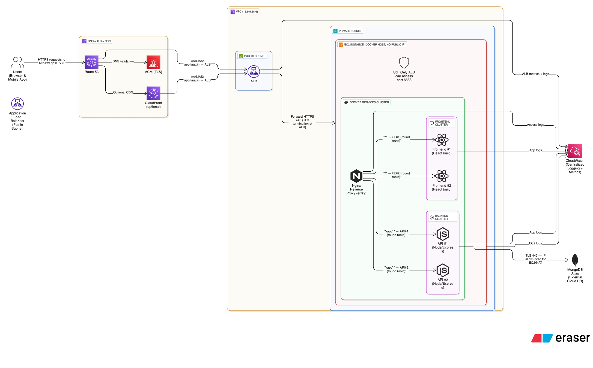

# MERN on AWS — Full Deployment Runbook



## Reference path

```
Single domain https://app.lauv.in
→ ALB (TLS via ACM)
→ private EC2 (Docker Compose)
→ Nginx reverse proxy
→ FE ×2 (React) & API ×2 (Node)
→ MongoDB Atlas
Logs & metrics → CloudWatch
Secrets → SSM
```

---

## Phase 0 — Baseline & Repo Hygiene (Local)

### Goal
Freeze current state; prove the API is healthy before infra.

### Why
Infra won't fix broken code. We need a known-good /api/health for later ALB checks.

### Do

Ensure .env has:

```
PORT=5000
NODE_ENV=production
MONGO_URI=<atlas-srv>
```

Make sure server.js binds 0.0.0.0 and has /api/health.

Commit: feat: baseline before docker+infra

### Test

```bash
node backend/server.js &
curl -s http://localhost:5000/api/health
# → {"ok":true,...}
```

### Done when
Local GET /api/health returns OK.

### Common fails

- Binding only 127.0.0.1 (fails in containers).
- Health path mismatch.

---

## Phase 1 — Local Docker Topology (mirror prod)

### Goal
One entry (proxy:8888). Everything else on internal bridge app_net. Logs mounted.

### Why
Local should behave like EC2: reverse proxy, service DNS, internal-only FE/API.

### docker-compose.yml (minimal skeleton)

```yaml
version: "3.9"

networks:
  app_net:
    driver: bridge

volumes:
  nginx_logs:
  api_logs:

services:
  proxy:
    image: nginx:alpine
    ports: ["8888:8888"]
    volumes:
      - ./proxy/nginx.conf:/etc/nginx/nginx.conf:ro
      - nginx_logs:/var/log/nginx
    depends_on: [frontend1, frontend2, api1, api2]
    networks: [app_net]

  frontend1:
    build: ./frontend
    expose: ["80"]
    networks: [app_net]

  frontend2:
    build: ./frontend
    expose: ["80"]
    networks: [app_net]

  api1:
    build: ./backend
    environment:
      - NODE_ENV=production
      - PORT=5000
      - MONGO_URI=${MONGO_URI}
    expose: ["5000"]
    volumes:
      - api_logs:/var/log/app
    networks: [app_net]

  api2:
    build: ./backend
    environment:
      - NODE_ENV=production
      - PORT=5000
      - MONGO_URI=${MONGO_URI}
    expose: ["5000"]
    volumes:
      - api_logs:/var/log/app
    networks: [app_net]
```

### proxy/nginx.conf (prod-like, health + RR + headers)

```nginx
worker_processes auto;
events { worker_connections 1024; }

http {
  log_format main '$remote_addr - $request [$time_local] "$request" '
                  '$status $body_bytes_sent "$http_referer" '
                  '"$http_user_agent" "$http_x_forwarded_for" '
                  'rid=$reqid';
  map $request_id $reqid { default $request_id; }
  access_log /var/log/nginx/access.log main;

  upstream fe {
    server frontend1:80;
    server frontend2:80;
  }
  upstream api {
    server api1:5000;
    server api2:5000;
  }

  server {
    listen 8888;

    # health for ALB
    location = /health { return 200 'ok\n'; add_header Content-Type text/plain; }

    # basic hardening
    add_header X-Content-Type-Options nosniff always;
    add_header X-Frame-Options SAMEORIGIN always;
    add_header X-Request-ID $reqid always;

    location /api/ {
      proxy_pass http://api;
      proxy_http_version 1.1;
      proxy_set_header Host $host;
      proxy_set_header X-Real-IP $remote_addr;
      proxy_set_header X-Forwarded-For $proxy_add_x_forwarded_for;
      proxy_set_header X-Forwarded-Proto $scheme;
      proxy_set_header X-Request-ID $reqid;
      proxy_connect_timeout 5s;
      proxy_read_timeout 60s;
    }

    location / {
      proxy_pass http://fe;
      proxy_http_version 1.1;
      proxy_set_header Host $host;
      proxy_set_header X-Forwarded-Proto $scheme;
      proxy_set_header X-Request-ID $reqid;
    }
  }
}
```

### Run & Test

```bash
docker compose up -d --build
docker network inspect $(basename $PWD)_app_net | jq '.[0].Containers | keys'
curl -s localhost:8888/health
curl -s localhost:8888/api/health
docker compose exec proxy sh -c 'tail -n2 /var/log/nginx/access.log'
```

### Done when
/health and /api/health pass, RR visible across FE/API.

### Common fails

- Using ports: on FE/API (should be expose only).
- Wrong MONGO_URI.

---

## Phase 2 — Request Correlation + API Access Logs

### Goal
Correlate edge↔app; confirm headers & CORS.

### Why
You need a single request ID end-to-end for debugging & observability.

### Express addition (example)

```javascript
// backend/middleware/requestLog.js
export default function requestLog(req, res, next) {
  const rid = req.headers['x-request-id'] || 'no-rid';
  const fwd = req.headers['x-forwarded-for'] || req.ip;
  console.log(JSON.stringify({
    t: new Date().toISOString(),
    rid,
    ip: fwd,
    ua: req.headers['user-agent'],
    path: req.originalUrl
  }));
  next();
}

// in server.js
import express from 'express';
import requestLog from './middleware/requestLog.js';
const app = express();
app.use(requestLog);
```

### Test

```bash
curl -s -H "X-Demo:1" localhost:8888/api/debug | jq
# compare $reqid in proxy access.log vs your API console/file logs
```

### Done when
Same X-Request-ID visible in proxy and API logs.

### Common fails

- Not forwarding X-Request-ID in Nginx.
- Missing /api/debug.

---

## Phase 3 — AWS Network Foundation (VPC)

### Goal
Secure minimal VPC per diagram.

### Why
Private compute, least-privilege edge, NAT egress for Atlas.

### Create

**VPC:** 10.0.0.0/16

**Subnets (2 AZs)**

- Public: 10.0.1.0/24, 10.0.2.0/24 (ALB, NAT)
- Private: 10.0.11.0/24, 10.0.12.0/24 (EC2)

**IGW** attached

**NAT Gateway** in a public subnet

**Route tables**

- Public RT: 0.0.0.0/0 → IGW
- Private RT(s): 0.0.0.0/0 → NAT

**Security Groups**

- ALB-SG: inbound 80,443 from Internet; egress to EC2-SG:8888
- EC2-SG: inbound 8888 only from ALB-SG; egress 0.0.0.0/0

### Done when
ALB can reach EC2 on 8888; EC2 can reach internet via NAT.

### Common fails

- NAT in private subnet (must be public).
- Wrong RT associations.

---

## Phase 4 — Private EC2 (Docker Host) + SSM-only

### Goal
Run the same compose stack in private (no public IP), access via Session Manager.

### Why
Zero-trust SSH, production parity with Phase 1.

### Launch

**AMI:** Amazon Linux 2023

**Subnet:** private

**Instance role:**
AmazonSSMManagedInstanceCore, CloudWatchAgentServerPolicy (ECR later)

### User data

```bash
#!/bin/bash
set -eux
dnf update -y
dnf install -y docker git
systemctl enable --now docker
curl -L https://github.com/docker/compose/releases/download/v2.29.2/docker-compose-linux-x86_64 -o /usr/local/bin/docker-compose
chmod +x /usr/local/bin/docker-compose

mkdir -p /opt/mern && cd /opt/mern
git clone https://github.com/<you>/<repo>.git .
echo "MONGO_URI=<your-atlas-uri>" > backend/.env

/usr/local/bin/docker-compose up -d --build
```

### Test (via Session Manager)

```bash
curl -s http://localhost:8888/health
curl -s http://localhost:8888/api/health
docker ps --format '{{.Names}}  {{.Ports}}'
```

### Done when
All containers healthy; internal health passes.

### Common fails

- No SSM role.
- Compose path mismatch.

---

## Phase 5 — ALB + Target Group + ACM + Route 53 (Single Host)

### Goal
https://app.lauv.in serves / and /api/* through ALB → proxy:8888.

### Why
Managed TLS, L7 routing, health checks, future multi-instance scale.

### Do

- **ACM:** request public cert for app.lauv.in (same region as ALB), DNS validate.
- **Target Group** (Instance or IP; HTTP :8888)
  - Health check: GET /health, Success codes 200
- **ALB** in public subnets with ALB-SG
  - Listener 80 → redirect to 443
  - Listener 443 (ACM cert) → forward to TG
- **Register target:** your EC2 instance (private IP)
- **Route 53:** A/ALIAS app.lauv.in → ALB

### Test

```bash
dig +short app.lauv.in
curl -I https://app.lauv.in/health
curl -s https://app.lauv.in/api/health
```

### Done when
Both endpoints green over HTTPS.

### Common fails

- ACM in wrong region.
- SG not allowing ALB→EC2:8888.

---

## Phase 6 — Atlas Allow-List & TLS

### Goal
Lock DB access to your infra.

### Why
Only your NAT EIP should talk to Atlas.

### Do

- In Atlas → Network Access: allow NAT Gateway EIP (or VPC peering later).
- Keep MONGO_URI secret (next phase uses SSM).

### Test (from Session Manager)

```bash
curl -s https://app.lauv.in/api/health
# remove allowlist to see failure; re-add to recover
```

### Done when
Health fails when removed, recovers when allowlist restored.

### Common fails

- Allowlisting ALB IP (it never hits Atlas; EC2 does).
- Using wrong EIP (region mixups).

---

## Phase 7 — Secrets & Config via SSM + Reload

### Goal
No secrets on disk/repo; controlled runtime env.

### Why
Security + auditability + future CI/CD injection.

### Store secret

```bash
aws ssm put-parameter \
  --name "/mern/MONGO_URI" \
  --type "SecureString" \
  --value "<atlas-uri>" \
  --overwrite
```

### Fetch + inject (deploy hook)

```bash
MONGO_URI="$(aws ssm get-parameter --name /mern/MONGO_URI --with-decryption --query 'Parameter.Value' --output text)"
cd /opt/mern/backend && printf "MONGO_URI=%s\n" "$MONGO_URI" > .env
cd /opt/mern && docker compose up -d --build
```

### Test

```bash
curl -s https://app.lauv.in/api/health
```

### Done when
App healthy; no plaintext secret in repo.

### Common fails

- Missing IAM perm: ssm:GetParameter.
- Wrong parameter name.

---

## Phase 8 — Observability (CloudWatch)

### Goal
Proxy access logs + API logs + ALB metrics → dashboards & alarms.

### Why
See traffic, errors, latency; alert before users complain.

### Agent config /opt/aws/amazon-cloudwatch-agent/etc/amazon-cloudwatch-agent.json

```json
{
  "logs": {
    "logs_collected": {
      "files": {
        "collect_list": [
          { "file_path": "/var/lib/docker/volumes/mern_nginx_logs/_data/access.log",
            "log_group_name": "mern/proxy/access", "log_stream_name": "{instance_id}" },
          { "file_path": "/var/lib/docker/volumes/mern_api_logs/_data/*.log",
            "log_group_name": "mern/api", "log_stream_name": "{instance_id}" }
        ]
      }
    }
  },
  "metrics": { "append_dimensions": { "InstanceId": "${instance_id}" } }
}
```

### Install & start

```bash
rpm -Uvh https://s3.amazonaws.com/amazoncloudwatch-agent/amazon_linux/amd64/latest/amazon-cloudwatch-agent.rpm
/opt/aws/amazon-cloudwatch-agent/bin/amazon-cloudwatch-agent-ctl \
  -a fetch-config -m ec2 -c file:/opt/aws/amazon-cloudwatch-agent/etc/amazon-cloudwatch-agent.json -s
```

### Example alarms

- ALB HTTPCode_ELB_5XX > 5 for 5m
- ALB TargetResponseTime p90 > 1s for 5m
- TG UnHealthyHostCount > 0

### Test

- Hit /api/tasks repeatedly; see logs in groups.
- Break API to trigger alarms.

### Done when
Logs stream to CW; alarms fire on failure.

### Common fails

- Wrong Docker volume host path.
- No CW Agent policy on role.

---

## Phase 9 — Optional CloudFront (later)

### Goal
CDN for static, bypass cache for /api/*.

### Why
Performance + edge security; keep API dynamic.

### Sketch

- **Origin** = ALB
- **Behavior1:** /* cache;
- **Behavior2:** /api/* cache disabled, forward all headers
- **Route 53** app.lauv.in → CloudFront ALIAS (when ready)

### Done when
Static pages cached, API always fresh.

### Common fails

- ACM cert must be in us-east-1 for CF.
- Missing header forwarding for API.

---

## Phase 10 — Blue/Green (single EC2)

### Goal
Near-zero downtime deploys via two TGs (8888/8889) & two proxy stacks.

### Why
Safer releases even on single host.

### Quick pattern

```bash
# Run new version on 8889
docker compose -p green -f docker-compose.yml up -d --build

# TG-green (port 8889) → wait healthy → switch ALB 443 listener to TG-green

# Kill old
docker compose -p default down
```

### Test

```bash
# Continuous probe while switching
hey -z 30s https://app.lauv.in/api/health
```

### Done when
Swap causes no visible outage.

### Common fails

- Health check path differs between stacks.
- Both stacks exposing same host port.

---

## Strict Verification Checklist (unchanged)

- ☐ Local compose: one exposed port 8888; /health & /api/health pass
- ☐ Nginx RR alternates across containers
- ☐ VPC public+private subnets; NAT in public; routes correct
- ☐ EC2 private (no public IP); reachable via SSM
- ☐ ALB 443 → TG(:8888) health green; SG edges enforced (ALB→EC2:8888 only)
- ☐ https://app.lauv.in serves / & /api/* correctly
- ☐ Atlas allow-list equals NAT EIP; break & restore validated
- ☐ SSM holds MONGO_URI; instance fetch works; no secret in repo
- ☐ CloudWatch has proxy & API logs; ALB metrics graphed; alarms tested
- ☐ (Later) CloudFront in front; (Later) blue/green TG swap verified

---

## What you learn (explicit map)

- **AWS:** VPC, subnets, IGW/NAT, SG, ALB/TG, ACM, Route 53, SSM, CloudWatch
- **Nginx:** reverse proxy, path routing, upstream RR, headers, health checks
- **Docker:** user bridge (app_net), service DNS, expose vs ports, volumes
- **Networking:** DNAT (ALB→proxy:8888), SNAT (EC2/NAT→Atlas:443), single-domain split
- **Ops:** secrets mgmt, centralized logs, alarms, blue/green rollouts

---

## Pitfalls & quick fixes

- **502 from ALB:** Target unhealthy (check /health path, SGs, port 8888).
- **Mongo failures:** NAT EIP not allow-listed; wrong MONGO_URI.
- **CORS errors:** set API CORS origin to the frontend domain; forward headers.
- **Logs empty:** volume host path mismatch; CW Agent not running.
- **ACM not selectable:** wrong region vs ALB/CF.